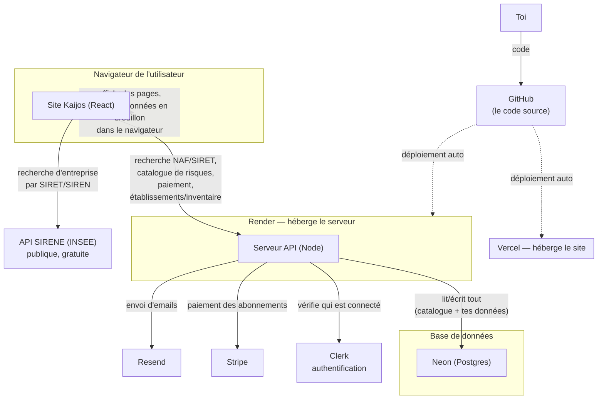

# Comment fonctionne Kaijos — guide pour toi, pas pour un dev

Ce document explique l'application telle qu'elle existe **aujourd'hui** (18 juillet 2026), en langage simple, pour que tu puisses la comprendre et la piloter dans le temps sans avoir à relire le code. Pour la référence technique détaillée (pour un futur développeur), voir `DUERP_README.md`. Pour le détail précis des sources de données (risques, questions, mesures correctives), voir `REFERENTIELS.md`.

---

## 1. En une phrase

Kaijos est une application web (site + petit serveur) qui aide une entreprise à remplir son **DUERP** (le document légal d'évaluation des risques professionnels). Elle s'appuie sur 5 services externes, chacun avec un rôle précis, et une base de données qui garde les informations.

---

## 2. Le schéma d'ensemble



**À retenir :** ton site (ce que voit un visiteur) et ton serveur (la partie qui parle aux bases de données et aux paiements) sont **deux choses hébergées séparément** — le site sur Vercel, le serveur sur Render. C'est normal et courant, mais ça veut dire qu'il y a deux endroits différents à surveiller/payer/redéployer.

---

## 3. Chaque brique, expliquée

### 🖥️ Le site (Vercel)
- **Ce que c'est :** la partie que voient tes visiteurs — la page d'accueil, le tableau de bord, l'inventaire, etc. Écrite en React.
- **Où la gérer :** [vercel.com/dashboard](https://vercel.com/dashboard) — c'est là que tu vois les déploiements, les erreurs, et les réglages du nom de domaine.
- **Coût :** gratuit pour un usage modéré ; payant (~20$/mois) si tu as besoin de plus de bande passante ou de fonctionnalités d'équipe.
- **Si ça casse :** en général une erreur de build après un changement de code — le dashboard Vercel montre le journal de compilation.

### ⚙️ Le serveur (Render)
- **Ce que c'est :** le programme qui fait le lien entre le site et les autres services (base de données, Stripe, Clerk, emails). Adresse actuelle : `kaijos-api.onrender.com`.
- **Où le gérer :** [dashboard.render.com](https://dashboard.render.com)
- **Coût :** le plan gratuit **se met en veille après inactivité** et met 15 à 60 secondes à se "réveiller" au prochain visiteur — gênant si le trafic est faible. Un plan payant (~7$/mois) élimine cette veille.
- **Si ça casse :** regarde les "Logs" dans le dashboard Render — c'est exactement ce que j'ai fait aujourd'hui pour diagnostiquer les pannes.

### 🗄️ La base de données — Neon
- **Ce que c'est :** l'endroit où sont stockées **toutes** les données : le catalogue de risques (référence) et tes établissements/unités/inventaire/plan d'action.
- **Ancien hébergeur :** Supabase — projet perdu le 18/07/2026 après une longue inactivité (voir le rapport de ce jour-là pour le détail de l'incident). Entièrement retiré du code depuis.
- **Hébergeur actuel :** **Neon**, région Europe (Francfort). Choisi parce qu'il ne supprime jamais les données en cas d'inactivité (juste une pause), contrairement à Supabase.
- **Où la gérer :** [console.neon.tech](https://console.neon.tech)
- **Coût :** gratuit pour commencer (0.5 Go), plans payants ensuite selon le volume.
- **Statut au 18/07/2026 :** migration terminée et testée en local. **Reste à faire :** mettre à jour les variables d'environnement en production (Render) — voir §7.

### 🔑 Clerk — qui a le droit de se connecter
- **Ce que c'est :** gère les comptes utilisateurs (inscription, connexion, mot de passe).
- **Où le gérer :** [dashboard.clerk.com](https://dashboard.clerk.com)
- **Coût :** gratuit jusqu'à 10 000 utilisateurs actifs/mois, largement suffisant pour démarrer.
- **Si ça casse :** personne ne peut se connecter au site — vérifier le statut sur le dashboard Clerk et que les clés dans les variables d'environnement (§5) sont toujours valides.

### 💳 Stripe — les paiements
- **Ce que c'est :** encaisse les abonnements (Starter 39€, PME 89€, Consultants 199€/mois).
- **Où le gérer :** [dashboard.stripe.com](https://dashboard.stripe.com) — factures, clients, remboursements, passage en mode réel (aujourd'hui : clés de **test**, aucun vrai paiement encaissé).
- **Coût :** pas d'abonnement, juste une commission par transaction réussie (autour de 1,5% + 0,25€ en France, à vérifier sur leur site).
- **Important avant le vrai lancement :** basculer des clés de test vers les clés live, et configurer le webhook Stripe pour qu'il pointe vers Render en production.

### ✉️ Resend — les emails automatiques
- **Ce que c'est :** envoie les emails (invitations, notifications).
- **Où le gérer :** [resend.com/emails](https://resend.com/emails)
- **Coût :** gratuit jusqu'à 3 000 emails/mois.

### 🔍 API SIRENE (INSEE)
- **Ce que c'est :** la recherche d'entreprise par SIRET/SIREN utilise le répertoire officiel des entreprises françaises. Gratuit, public, rien à gérer de ton côté.

### 📦 GitHub — le code
- **Ce que c'est :** l'historique de toutes les versions du code. Vercel et Render se reconnectent à GitHub pour redéployer automatiquement à chaque changement poussé (`git push`).

---

## 4. Point corrigé : un seul chemin de données

Jusqu'au 18/07/2026, tes données ne vivaient pas toutes au même endroit : le catalogue de risques passait par ton serveur, mais tes établissements/unités/inventaire/plan d'action allaient **directement** du site vers Supabase, en court-circuitant le serveur — un chemin que le code lui-même signalait comme non sécurisé pour la production (écriture directe depuis le navigateur, sans vérification serveur).

C'est corrigé : toutes les données passent maintenant par ton serveur, qui vérifie que la personne est bien connectée (via un vrai jeton de session Clerk, pas juste un mot de passe technique partagé) avant de lire/écrire quoi que ce soit dans Neon. Un seul système à surveiller, et chaque utilisateur ne voit que ses propres données.

---

## 5. Où vivent les mots de passe et clés (variables d'environnement)

- **En local (ton PC) :** fichier `.env.local` à la racine du projet — jamais envoyé sur GitHub (protégé par `.gitignore`).
- **En production :** chaque hébergeur a ses propres réglages —
  - Render : dashboard du service → onglet "Environment"
  - Vercel : dashboard du projet → "Settings" → "Environment Variables"
- **Règle d'or :** si une clé change (ex. nouvelle base de données), il faut la mettre à jour **aux deux endroits** — en local ET sur Render/Vercel — sinon la production continue d'utiliser l'ancienne.

---

## 6. Lancer le projet en local (résumé)

```
npm install          # une seule fois, ou après ajout d'une dépendance
npm run dev:full      # lance le site (5173) et le serveur (8787) ensemble
```
Puis ouvrir `http://localhost:5173`.

---

## 7. Chantiers en cours (au 18/07/2026)

1. **Migration Supabase → Neon** — terminée en local (§4). Reste à mettre à jour les variables d'environnement sur Render (production) avec la chaîne de connexion Neon, et à faire un vrai test de connexion en conditions réelles (une tentative automatisée a été bloquée par la protection anti-robot de Clerk, volontairement non contournée — un clic manuel de ta part suffit à vérifier).
2. **Bug du moteur de notation des risques** — le calcul automatique des scores plante à cause d'un décalage entre un fichier de configuration et le code qui le lit. Corrigé en premier avant d'ajouter de nouvelles fonctionnalités IA.
3. **Amélioration du contenu des risques** — après le point 2 : connecter une IA générative pour rédiger/affiner les risques et mesures, puis explorer les bases réglementaires officielles (INRS, OPPBTP, CARSAT).
4. **Pages légales manquantes** — mentions légales, confidentialité, support (liens déjà présents sur la page d'accueil mais pointent vers rien).

---

## 8. Petit glossaire

- **API** : la porte par laquelle le site demande des informations au serveur (ex. "donne-moi la liste des risques").
- **Variable d'environnement** : un réglage secret (mot de passe, adresse) stocké à part du code, jamais visible publiquement.
- **Déploiement** : le fait de mettre en ligne une nouvelle version du code.
- **Base de données (Postgres)** : le classeur numérique où sont rangées toutes les données de manière structurée.
- **CORS** : la règle de sécurité qui empêche un site de parler à un serveur qui ne l'a pas explicitement autorisé — cause fréquente d'erreurs "ça ne marche pas en local mais marche en ligne" (ou l'inverse).
