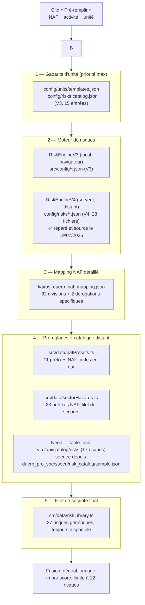
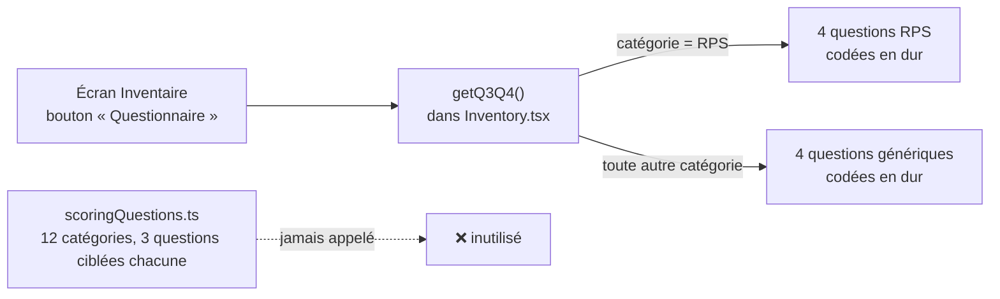
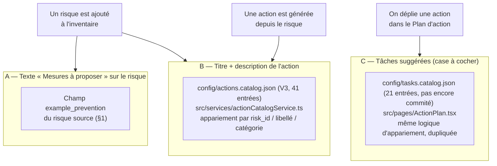

# D'où viennent les risques, les questions et les mesures — état réel au 19/07/2026

Tu as demandé d'où viennent aujourd'hui les risques proposés, les questions du questionnaire de pondération, et les mesures correctives suggérées. Réponse courte : **de beaucoup d'endroits différents, empilés au fil du développement**, avec un système plus riche construit mais jamais branché, et une vraie base de données (Neon) qui ne contient qu'une petite partie de tout ça. Détail ci-dessous, avec les fichiers exacts.

**Mise à jour du 19/07/2026** — RiskEngineV4 est réparé (voir `ARCHITECTURE.md`) et le catalogue de risques (les 28 fichiers `config/risks/*.json` + les 27 de `src/data/riskLibrary.ts`, soit 55 au total) est maintenant sourcé avec de vrais documents officiels vérifiables — voir §4.

Complète `ARCHITECTURE.md` (qui explique l'infrastructure) — celui-ci explique **le contenu métier**.

---

## 1. Les risques (inventaire)

Quand tu cliques « Pré-remplir », l'app interroge **7 sources différentes dans un ordre de priorité fixe**, et empile les résultats jusqu'à avoir au moins 8 risques (`src/services/prefillService.ts`).



**Ce qu'il faut retenir :**
- Le moteur « IA » distant (RiskEngineV4) est réparé depuis le 19/07/2026 et produit maintenant de vrais résultats sectoriels (ex. boulangerie → atmosphères explosives, brûlures, agents chimiques... au lieu d'une liste générique). Voir `ARCHITECTURE.md` pour le détail des 4 bugs corrigés.
- La base de données Neon (`risk` table) ne contient que **17 risques** — un petit échantillon, pas le catalogue complet. La vraie richesse vient aujourd'hui des fichiers statiques (`riskLibrary.ts`, `config/risks/`), pas de la base.
- Il existe **trois emplacements distincts** pour des catalogues de risques qui se ressemblent : `src/config/` (utilisé par le moteur V3, dans le navigateur), `config/` à la racine (utilisé par le moteur V4, sur le serveur — 28 fichiers, un par risque), et `duerp_pro_spec/seed/` (utilisé une seule fois pour remplir Neon). Ce sont trois listes **différentes**, pas trois copies de la même chose — pas de vraie source unique de vérité.

---

## 2. Les questions du questionnaire de pondération

Plus simple, mais avec une vraie occasion manquée.

**Ce qui est réellement utilisé** : 4 questions fixes, codées en dur dans `src/pages/Inventory.tsx` (`Q1_MAP`, `Q2_MAP`, fonction `getQ3Q4`). Les questions 1 et 2 (gravité, fréquence) sont toujours les mêmes. Les questions 3 et 4 n'ont que **deux variantes** : une pour les risques psychosociaux, une générique pour tout le reste.

**Ce qui existe mais n'est jamais appelé** : `src/data/scoringQuestions.ts` — un système bien plus abouti, avec des questions **spécifiques à 12 catégories de risques** (chimique, mécanique, électrique, incendie/explosion, manutention, chutes, RPS, écran, bruit, biologique, routier...), chacune avec 3 sous-questions ciblées. Ce fichier a été construit mais **jamais branché à l'écran** — c'est un système plus riche qui dort dans le code.



---

## 3. Les mesures correctives

C'est le point le plus éclaté : **trois mécanismes séparés**, avec des sources différentes, qui se chevauchent sans être reliés entre eux.



**Ce qu'il faut retenir :**
- **A** (le texte libre "mesures à proposer" visible dès l'ajout du risque) vient directement du risque source lui-même — donc de n'importe laquelle des 7 sources du §1, selon celle qui a matché.
- **B** (l'action générée automatiquement, avec son titre) et **C** (les tâches suggérées une fois l'action dépliée) viennent de **deux catalogues séparés** (`config/actions.catalog.json` et `config/tasks.catalog.json`), avec une logique d'appariement (« quel risque correspond à quelle action ? ») **copiée-collée à l'identique dans deux fichiers différents** (`actionCatalogService.ts` et `ActionPlan.tsx`) — si on corrige un alias dans l'un, il faut penser à le refaire dans l'autre.
- `config/tasks.catalog.json` n'est pour l'instant pas suivi par Git (fichier local, jamais commité) — à vérifier si c'est voulu.

---

---

## 4. Sourcing du catalogue de risques (mis à jour le 19/07/2026)

**Avant :** 25 des 28 fichiers `config/risks/*.json` citaient juste `["INRS","CARSAT","EU-OSHA"]` de façon générique et identique — pas un vrai document. `riskLibrary.ts` (27 risques) n'avait aucune source du tout.

**Maintenant :** les 55 risques (28 + 27) citent chacun un document officiel précis et vérifiable, avec une date de vérification. Exemples :
- Explosion de poussières (ATEX) → **INRS ED 945**, Mise en œuvre de la réglementation Atex
- Brûlures en cuisine/fournil → **INRS ED 6490**, Prévenir les risques de brûlures dans les métiers de bouche et la restauration
- TMS / manutention → **INRS ED 6518**, Démarche de prévention des TMS
- Sanitaires/vestiaires → **Code du travail, art. R.4228-1** (référence légale directe, plus précise qu'une brochure)

Chaque risque porte maintenant deux champs : `sources` (ou `source` dans `riskLibrary.ts`) — le document précis — et `sources_verified` — la date à laquelle la citation a été vérifiée comme réelle et pertinente. Trois entrées déjà bien sourcées avant le 19/07/2026 (R-CMR, R-TRAVAUX-PUB, et le fichier `R-CHUTE.json`) n'ont pas été retouchées et n'ont donc pas cette date — à vérifier un jour aussi, pas urgent.

**Problème annexe trouvé en sourçant** : deux fichiers différents (`R-CHUTE.json` et `R-GLISSADES.json`) partagent le même identifiant interne `R-GLISSADES`. Le moteur les charge dans une liste indexée par identifiant, donc le second écrase silencieusement le premier — `R-CHUTE.json` (« Chutes de plain-pied et de hauteur ») n'est en réalité **jamais utilisé**, malgré sa présence sur le disque. Pas corrigé pour l'instant (`R-CHUTE-HAUTEUR` couvre déjà la partie « hauteur » séparément, donc l'impact pratique est faible) — à nettoyer un jour.

### Processus de mise à jour périodique

Une commande vérifie l'état du sourcing à tout moment :
```
npm run duerp:sources:audit
```
Elle signale : les risques sans aucune source, les sources encore génériques (pas de numéro de document), et celles vérifiées il y a plus d'un an. Concrètement :
- **Une fois par an** (ou plus tôt si l'INRS/la CARSAT/l'OPPBTP publie une refonte majeure d'un guide déjà cité), lancer l'audit et revérifier les entrées signalées comme anciennes — les brochures INRS sont parfois rééditées avec un nouveau numéro.
- **À chaque nouveau risque ajouté** au catalogue, lui donner une vraie source dès la création plutôt qu'un texte générique, pour ne pas recréer la dette d'aujourd'hui.
- Pas encore fait, à envisager plus tard : afficher la source dans l'écran Inventaire lui-même (elle vit aujourd'hui dans les données mais ne remonte pas jusqu'à l'interface) — utile si un client ou un contrôle demande d'où vient un risque.

## Ce qui n'est pas utilisé du tout aujourd'hui

- **Les obligations légales** (`config/obligations/*.json`, table Neon `obligation`, route `/api/catalog/obligations`) existent côté données mais **ne s'affichent nulle part** dans l'app actuelle.
- **`scoringQuestions.ts`** (§2) — le questionnaire riche par catégorie, jamais branché.
- Les fichiers NAF sectoriels du moteur V3 (`src/config/naf/*.json`) ne couvrent que **4 secteurs** (commerce, restauration, santé, action sociale) sur l'ensemble des codes NAF possibles.

## Pourquoi c'est comme ça (probablement)

Cette organisation ressemble à plusieurs vagues de développement successives (V3 front léger → V4 API plus structuré → tentative de base de données Neon/Supabase) qui ne se sont jamais complètement remplacées les unes les autres — chaque couche a été ajoutée comme filet de sécurité au-dessus de la précédente plutôt que de la remplacer. Ce n'est pas cassé (le pré-remplissage fonctionne), mais c'est **fragile à faire évoluer** : ajouter un risque « proprement » demanderait aujourd'hui de savoir dans lequel des 5+ endroits l'ajouter, et personne ne peut le deviner sans ce document.

**Piste naturelle pour la suite** (à ne pas faire maintenant, juste à garder en tête) : consolider vers une seule source de vérité — la base Neon — et faire passer risques, actions, tâches et questions par elle plutôt que par des fichiers JSON éparpillés. C'est un chantier à part, plus gros que les corrections rapides déjà faites.
